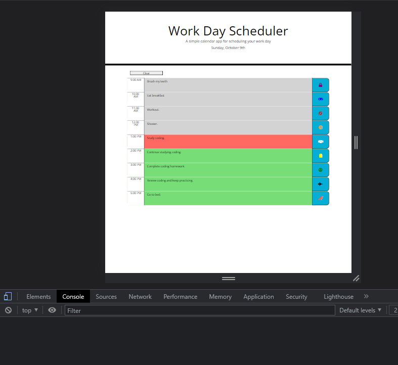
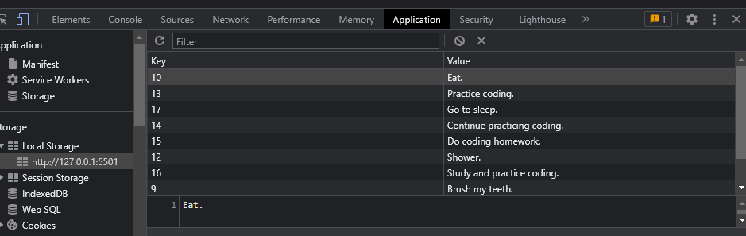

# Work Day Scheduler - Powered by JavaScript/Third-Party APIs.

This is Homework Challenge # 5. 

* I used JavaScript and Third-Party APIs to provide functionality to the website.

## Table of Contents 

* [Overview](#overview)

* [How-It-Works](#how-it-works)

* [Test](#test)

* [License](#license)

* [Contributing](#contributing)

* [Link](#link)
   
* [Screenshot](#screenshot)

* [Questions](#questions)

## Overview

This application is made to function as a live hour by hour journal.

## How-It-Works

The current date will always be displayed at the top of the page in real time. The user can enter and save events throughout their day as a schedule. The scheduler is color-coded to visually aid the user with past, present, and future time slots. Once the user enters their data, they can save it by clicking the "save" icon to the right of the entered text on the journal. The user can also clear the journal by pressing the clear button. If user does not clear, the data will be present upon reloading the page. 

* Red = current time
* Gray = past time
* Green = future time
* "save" icons = blue button with photos inside.

## Test

You can test this application by entering data into the journal and saving it. Then go to the console.log(s) to view any errors or the locally saved data.
If you do not click the clear button and reload the page, the saved data will be present.

## License

This project is not licensed at this time.
<!--  -->
  
## Contributing

My coding class, [MDN](https://developer.mozilla.org/en-US/), [W3 Schools](https://www.w3schools.com/), [FontAwesome](https://fontawesome.com/), [Moment.js](https://momentjs.com/)..

## Link
Click [here](https://github.com/sbullocks/homework-challenge5) to access the live website.

## Screenshot

 

## Questions

If you have any questions about the repo, contact me directly at sbullocks@gmail.com. You can find more of my work at [sbullocks](https://github.com/sbullocks).
